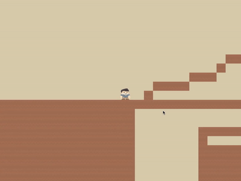

# C++ Game Engine

My attempt to create a game engine. Thanks to [TheCherno](https://www.youtube.com/playlist?list=PLlrATfBNZ98dC-V-N3m0Go4deliWHPFwT)!

## What this game engine aims to be:

1. A learning experience in low-level C++ programing and low-level graphics programming
2. Use Object Oriented Design patterns that C++ provides to make a clean interface to develop graphical applications with event handlers.
3. 2D only (for now)
4. Not Unity or Unreal

## What's built

- The basic: window rendering, event handling
- A little more than the basics: 2D sprites, batch rendering, collision detection and physics, an orthographic camera

## What you can build with it

- 2D platformers (like Super Mario)
- 2D RPGs (like The Legend of Zelda)

Like this one:

## Credits and Future Plans

This project is basically a follow-along of [this](https://www.youtube.com/playlist?list=PLlrATfBNZ98dC-V-N3m0Go4deliWHPFwT) fantastic series (still under production as of 15 September 2020).

As of today (15 September 2020), I have to put this project on hold (academic + job commitments).
I hope to get back to this as soon as possible.
